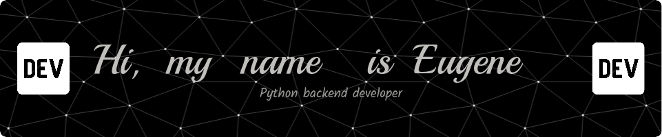

### I am a certified PYTHON BACKEND developer.

### Graduated from the online university "Netology" with a degree in "Python developer from scratch".

### I've been programming since school, I started professionally in 2019.

## My professional stack:

                  

